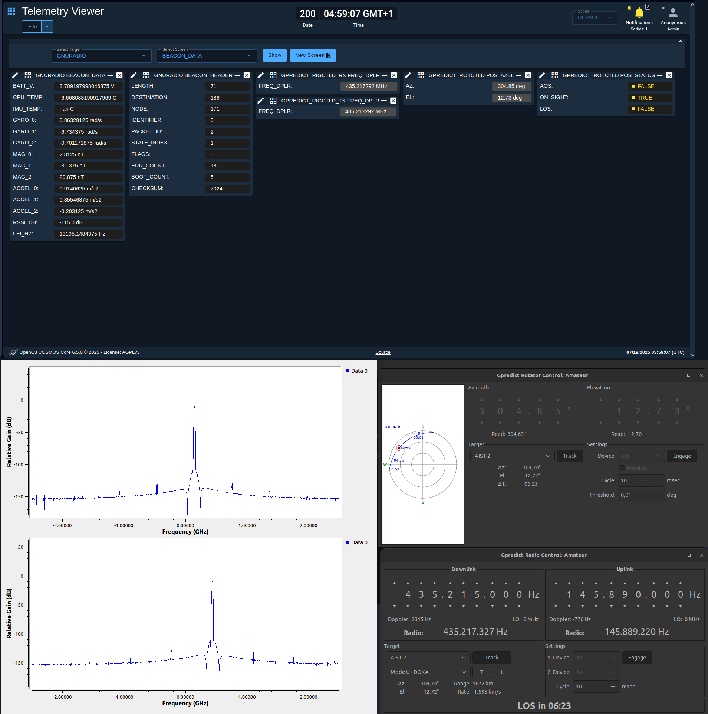

# OpenC3 COSMOS Ground Station



OpenC3 COSMOS is a cloud native, containerized, microservice oriented command and control system, enabling an all-in-one management platform. This repository will host the files and documentation required to build a custom ground station for a ghost satellite mission.

A few concepts are required to understand COSMOS. A short summary was written based on the [official documentation](https://docs.openc3.com/docs/configuration):

> - Plugins: how you configure and extend COSMOS. Plugins define targets, their communication properties, and configure the interfaces needed to talk to them. Each plugin is built as a Ruby gem and thus has a `plugin.gemspec` file which builds it. Plugins have a `plugin.txt` file which declares all the variables used by the plugin and how to interface to the target it contains.
>
> - Targets: external pieces of hardware and/or software that COSMOS communicates with. Targets can receive commands sent by COSMOS and respond with telemetry.
>
> - Commands: information sent to targets. They can come from a script (Script Runner), a tool like Command Sender, or just generally through an API call. The commands packets' structure is defined in the `cmd.txt`.
>
> - Telemetry: information received by targets. The system will log the raw packet, parse it to engineering values, and log the converted data. The telemetry packets' structure is defined in the `tlm.txt`.
> 
> - Interfaces: established connections to targets, enabling data transfer. They are defined by the top level INTERFACE keyword in the `plugin.txt` file. The interface could be TCP/IP, UDP, serial, MQTT, or custom ones.
>
> - Protocols: behaviour of an interface, including differentiating packet boundaries and modifying data as necessary. They are typically used to define the logic to delineate packets and manipulate data as it written to and read from interfaces.
>
> - Conversions: data manipulation functions. They can be applied to both command parameters and telemetry items to modify the values sent to and received from targets.

<br /> 

## Installing the required software

### Docker

All COSMOS microservices are docker containers, which is why Docker is the first package needed to be installed. Following the [Docker Engine installation guide for Ubuntu](https://docs.docker.com/engine/install/ubuntu/):

> 1. Set up Docker's `apt` repository:
>```bash
>user@machine ~
># Add Docker official GPG key
>$ sudo apt-get update
>$ sudo apt-get install ca-certificates curl
>$ sudo install -m 0755 -d /etc/apt/keyrings
>$ sudo curl -fsSL https://download.docker.com/linux/ubuntu/gpg -o /etc/apt/keyrings/docker.asc
>$ sudo chmod a+r /etc/apt/keyrings/docker.asc
>
># Add the repository to apt sources
>$ echo \
>  "deb [arch=$(dpkg --print-architecture) signed-by=/etc/apt/keyrings/docker.asc] https://download.docker.com/linux/ubuntu \
>  $(. /etc/os-release && echo "${UBUNTU_CODENAME:-$VERSION_CODENAME}") stable" | \
>  sudo tee /etc/apt/sources.list.d/docker.list > /dev/null
>$ sudo apt-get update
>```
>
> 2. Install the Docker packages:
>
>```bash
> user@machine ~
> $ sudo apt-get install docker-ce docker-ce-cli containerd.io docker-buildx-plugin docker-compose-plugin
>```
>
> 3. Verify that the installation is successful by running the hello-world image:
>
>```bash
> user@machine ~
> $ sudo docker run hello-world
>```

<br />

Some extra steps are required to fully configure Docker Engine, such as [enabling Docker to be managed with a non-root user](https://docs.docker.com/engine/install/linux-postinstall/#manage-docker-as-a-non-root-user):

> 1. Create the docker group:
>
>```bash
> user@machine ~
> $ sudo groupadd docker
>```
>
> 2. Add your user to the docker group:
>
>```bash
> user@machine ~
> $ sudo usermod -aG docker $USER
>```
>
> 3. Activate the changes to groups. This command is necessary again once the shell is closed:
>
>```bash
> user@machine ~
> $ newgrp docker
>```
>
> 4. Verify that you can run docker commands without `sudo`:
>
>```bash
> user@machine ~
> $ docker run hello-world
>```

<br /> 

The Docker Compose is also required. Following its [appropriate tutorial](https://docs.docker.com/compose/install/linux/#install-using-the-repository):

> 1. Update the package index and install the latest version:
>
>```bash
> user@machine ~
> $ sudo apt-get update
> $ sudo apt-get install docker-compose-plugin
> $ sudo apt-get install docker-compose
>```
>
> 2. Verify the installation:
>
>```bash
> user@machine ~
> $ docker-compose --version
>```

<br /> 

### COSMOS

Following the [COSMOS installation guide](https://docs.openc3.com/docs/getting-started/installation):

> 1. Download the COSMOS project template to get started:
>
> ```bash
> user@machine ~
> $ git clone https://github.com/OpenC3/cosmos-project.git
> ```

Alternatively, this repo can be also be cloned, as it is a `cosmos-project` fork.

> 2. Add the locally cloned project directory to your PATH:
>
> ```bash
> user@machine ~
> $ export PATH=~/openc3-cosmos-gs:$PATH
> ```
>
> 3. Verify if COSMOS services are running smoothly:
>
> ```bash
> user@machine ~
> $ ./openc3.sh run 
> ```
>
> 4. Connect a web browser to `http://localhost:2900` and the COSMOS' GUI should appear. 

<br /> 

### Hamlib

Hamlib provides programs with a consistent API for controlling the myriad of radios and rotators available to amateur radio and communications users. This package is particularly required to establish a connection between Gpredict, COSMOS and our rotators.

Following its [installation guide](https://hamlib.sourceforge.net/manuals/1.2.15/_i_n_s_t_a_l_l.html):

>1. Download the latest package from [SourceForge](https://sourceforge.net/projects/hamlib/);
>
>2. Extract the .tar.gz file and open a shell in that folder;
>
>3. Run the following commands:
>
>```bash
>user@machine ~/hamlib
>$ /configure
>$ make
>$ sudo make install
>$ sudo ldconfig
>```
>
>4. Confirm the installation success:
>
>```bash
>user@machine ~/hamlib
>$ rotctld --version
>```

<br /> 

## Getting started

Cloning this repository and running the `start.sh` script is likely enough to get you going. However, a basic tutorial was made on how each important part of the software was created, leaving some tips and learned lessons for those who want to replicate in their own way.

### Setting up a new COSMOS project

After installing OpenC3 COSMOS and launching the GUI, a demo plugin comes already installed in the project template to help the user get accomodated to the platform capabilities. We leveraged the project template for our application, however, a clean start was desired, so before implementing any developments, the demo plugin was disabled:

1. Went to `/openc3-cosmos-gs` folder and open `.env` file;

2. Commented `OPENC3_DEMO` variable on line 6:
```bash
# OPENC3_DEMO=1
```

3. On COSMOS GUI, went to Admin Console > Plugins, and uninstalled `openc3-cosmos-demo` plugin.

Next, our first plugin to obtain the satellite position was implemented, as it is the initial and main driver in the operation pipeline. All other steps, such as orientating the antennas or communicating with the satellite, are dependent on its position, since they only begin once it starts appearing in our visible sky. Several programs track satellites, but Gpredict was used to achieve this purpose.

Following the [documentation](https://docs.openc3.com/docs/getting-started/gettingstarted):

> 1. Used the COSMOS plugin generator to create the correct structure:
>
>```bash
>user@machine ~/openc3-cosmos-gs
>$ openc3.sh cli generate plugin gpredict --python
>```

The `openc3-cosmos-gpredict` plugin folder was generated to include all the necessary components for communicating with the Gpredict application. Within this plugin, three targets were defined:

1. A `rotctld` interface for retrieving the satellite’s position;
2. A `rigctld` interface for retrieving the satellite’s transmit (TX) frequency, corrected for Doppler shift;
3. A second `rigctld` interface for retrieving the satellite’s receive (RX) frequency, also Doppler-corrected.

To support this, only two unique target structures needed to be created: `GPREDICT_ROTCLTD` and `GPREDICT_RIGCLTD`. The structure of `GPREDICT_RIGCLTD` (primarily commands and telemetry) could be shared for both the TX and RX interfaces.

> 2. The `GPREDICT_RIGCLTD` target was generated in the plugin folder with:
>
>```bash
>user@machine ~/openc3-cosmos-gpredict
>$ openc3.sh cli generate target GPREDICT_RIGCLTD --python
>```

Two new folders were created under `/targets`, where a scaffolding of the remaining concepts (commands, telemetry, conversions) were implemented, obviously specific to these targets.


<br /> 

## Retrieve satellite position and frequencies from Gpredict

This method basically uses Gpredict compatibility with `rotctld` and `rigctld` as a data pass-through. Based on [Joshua Guthrie's tutorial](http://westmouthbay.com/2020/01/10/getting-pointing-information-from-gpredict-for-use-in-an-external-program/):

> 1. Gpredict was started, and the ground station details and satellite to track were configured;
>
> 2. A dummy rotator interface in Gpredict was defined, on Edit > Preferences > Interfaces > Rotators;
>
> 3. An host and port for the TCP interface were selected (localhost:4533);
>
> 4. A `rotctld` service instance was started;
>
> 5. In Menu > Antenna Control, the desired satellite was chosen;
>
> 6. Pressing 'Engage', then 'Track' will finish the setup;
>
> 7. Confirmation of the TCP interface running can be checked on the defined host and port:
> 
> ```bash
> user@machine ~
> $ echo "-p" | nc -w 1 localhost 4533
> get_pos:-Azimuth: 294.51-Elevation: 26.09-RPRT 0
>```

This process was repeated for the remaining two interfaces of `rigctld`:

8. Two dummy radio interfaces in Gpredict were defined, on Edit > Preferences > Interfaces > Radios, one `RX only` and other `TX only` types;

9. The ports 4532 and 4531 of localhost were selected, respectively;

10. Each `rigctld` service instance was started on the respective port;

11. In Menu > Radio Control, desired satellite was chosen again;

12. Selecting the two devices, pressing 'Engage' and 'Track' will make the deal;

13. Again, confirmation of the TCP interfaces running can be performed on the defined host and port:

```bash
user@machine ~
$ echo "-f" | nc -w 1 localhost 4532
get_freq:-Frequency: 145000000-RPRT 0
```

<br /> 

## Request satellite position and frequencies on COSMOS

With this previous knowledge, the COSMOS plugin was configured to send a string (command) `"-p"` to the defined `rotctld` target, hosted on `localhost:4533` via TCP/IP (interface), where a `get_pos` string (telemetry) is responded with the desired azimuth and elevation angles. Additionally, a similar approach was adopted for both `rigctld` targets, by sending the `"-f"` command, with a `get_freq` response, as observed on the above code snippets. The distinction on RX and TX frequencies is made depending on the desired target.

<br /> 

### Create the command packet structure

The described commands were then added to the `cmd.txt` files of each target, following [commands documentation](https://docs.openc3.com/docs/configuration/command). Here's the implementation for `GPREDICT_ROTCTLD` target, as example:

```ruby
COMMAND GPREDICT_ROTCTLD SAT_POS_AZEL_CMD BIG_ENDIAN "Request satellite position"
  # Keyword           Name  BitSize Type   Min Max  Default  Description
  APPEND_ID_PARAMETER ID    0       STRING          "-p"     "Get position argument"
```

<br /> 

### Create the telemetry packet structure

Similarly, the telemetry packets that are responded for each command were configured so that the incoming data can be parsed to extract the intended information (position or frequency, depending on the target). As such, the telemetry packets were defined in the respective `tlm.txt` file of each target, following [telemetry documentation](https://docs.openc3.com/docs/configuration/telemetry). Here's the implementation for `GPREDICT_ROTCTLD` target, as example:

```ruby
TELEMETRY GPREDICT_ROTCTLD SAT_POS_AZEL_PKT BIG_ENDIAN "Satellite position"
  # Keyword       Name    BitSize Type    Default     Description
  APPEND_ID_ITEM  ID      64      STRING  "get_pos:"  "Position packet identifier"
  APPEND_ITEM     AZ_STR  128     STRING              "Azimuth string data"    
  APPEND_ITEM     EL_STR  0       STRING              "Elevation string data"
  ITEM            AZ      0 0     DERIVED             "Azimuth"
    READ_CONVERSION azimuth_conversion.py
    UNITS Degrees deg
  ITEM            EL      0 0     DERIVED             "Elevation"
    READ_CONVERSION elevation_conversion.py
    UNITS Degrees deg
```

This way, the incoming data is first divided into three strings: 
1. the packet identifier `get_pos:`, with 8 characters (or 8*8=64 bits), for validating purposes;
2. the azimuth information `-Azimuth: ***.**`, with 16 characters at max (or 128 bits);
3. the elevation information `-Elevation: **.**`, with the remaining characters, which include the return flag.

Then, the azimuth and elevation are searched on the respective defined string and converted to floats (therefore considered derived datatypes), with the functions developed for that purpose following the [conversions documentation](https://docs.openc3.com/docs/configuration/conversions). For example, here's the main code snippet of the `azimuth_conversion.py` implementation:
```python
match = re.search(r'Azimuth:\s*([\d.]+)', packet.read("AZ_STR"))
return float(match.group(1))
```

Lastly, the units are added to complement the data when screening the variables. 

A very similar approach is made to `GPREDICT_RIGCTLD` targets.

<br /> 

### Configure the interface

Lastly, the `gpredict` plugin interface was configured on `plugin.txt` file, following the [interfaces documentation](https://docs.openc3.com/docs/configuration/interfaces):

```ruby
## ROTCTLD interface

VARIABLE gpredict_rotctld_target_name GPREDICT_ROTCTLD
VARIABLE gpredict_rotctld_host host.docker.internal
VARIABLE gpredict_rotctld_port 4533

TARGET GPREDICT_ROTCTLD <%= gpredict_rotctld_target_name %>
INTERFACE <%= gpredict_rotctld_target_name %>_INT openc3/interfaces/tcpip_client_interface.py  <%= gpredict_rotctld_host %> <%= gpredict_rotctld_port %> <%= gpredict_rotctld_port %> 5.0 5.0 BURST
  MAP_TARGET <%= gpredict_rotctld_target_name %>

## RIGCTLD RX interface

VARIABLE gpredict_rigctld_target_name_rx GPREDICT_RIGCTLD_RX
VARIABLE gpredict_rigctld_host_rx host.docker.internal
VARIABLE gpredict_rigctld_port_rx 4532

TARGET GPREDICT_RIGCTLD <%= gpredict_rigctld_target_name_rx %>
INTERFACE <%= gpredict_rigctld_target_name_rx %>_INT openc3/interfaces/tcpip_client_interface.py <%= gpredict_rigctld_host_rx %> <%= gpredict_rigctld_port_rx %> <%= gpredict_rigctld_port_rx %> 5.0 5.0 BURST
  MAP_TARGET <%= gpredict_rigctld_target_name_rx %>

## RIGCTLD TX interface

VARIABLE gpredict_rigctld_target_name_tx GPREDICT_RIGCTLD_TX
VARIABLE gpredict_rigctld_host_tx host.docker.internal
VARIABLE gpredict_rigctld_port_tx 4531

TARGET GPREDICT_RIGCTLD <%= gpredict_rigctld_target_name_tx %>
INTERFACE <%= gpredict_rigctld_target_name_tx %>_INT openc3/interfaces/tcpip_client_interface.py <%= gpredict_rigctld_host_tx %> <%= gpredict_rigctld_port_tx %> <%= gpredict_rigctld_port_tx %> 5.0 5.0 BURST
  MAP_TARGET <%= gpredict_rigctld_target_name_tx %>
```

The target name, host, and port were defined as variables to allow customization in web GUI, if intended. Consequently, the TCP/IP client interface setup was done with respect to the host and port variables. Three arguments are required on the `INTERFACE` after the port number: 

1. Write timeout: set to `5.0` seconds;
2. Read timeout: set to `5.0` seconds;
3. Protocol: set to `BURST`, as default, so that it reads as much data as it can from the interface before returning the data.

The host was defaulted to `host.docker.internal`, instead of `localhost`, as it is containerized.

The three desired targets were instanced here, one with the `GPREDICT_ROTCTLD` structure and two with the `GPREDICT_RIGCTLD` structure.

<br /> 

### Build the plugin

Finally, the plugin can be built and uploaded to COSMOS. First, the `.gemspec` and `LICENSE` files were updated. Then, following the [documentation](https://docs.openc3.com/docs/getting-started/gettingstarted):

> 1. The plugin was built, specifying its version: 
>
>```bash
> user@machine ~/openc3-cosmos-gs/openc3-cosmos-gpredict
> $ openc3.sh cli rake build VERSION=1.0.0
>```
>
> 2. Once built, the web GUI was open, then following Admin Console > Plugins;
>
> 3. Clicked on "Install new plugin", selected the generated  `openc3-cosmos-gpredict-1.0.0.gem` file and pressed "Upload";
 
The `VARIABLES` pop-up appeared for customization, but it was not mandatory to modify anything, as the default and intended values were defined on `plugin.txt`.

> 4. If changes are made to the plugin source code, rebuild the plugin with a new `VERSION` number, following step 1 and 2;
> 
> 5. Instead of installing a new plugin, this time click the clock icon next to `openc3-cosmos-gpredict-1.0.0` to upgrade it.

<br /> 

### Communicate with the target

Once the plugin was loaded to COSMOS, the satellite position from Gpredict was obtained:

1. On the web GUI, follow to CmdTlmServer side tab > Interfaces, and confirm that the interface `GPREDICT_INT` is connected and ready for communication;

2. Then, go to Command Sender side tab, select the `GPREDICT_ROTCLTD` target and `SAT_POS_AZEL_CMD` command packet, and hit "Send";

3. Finally, go to Packet Viewer side tab, select the `GPREDICT_ROTCLTD` target and `SAT_POS_AZEL_PKT` telemetry packet, where all items should be successfully parsed and displayed;

4. These will be very similar to the ones on Gpredict, with the exception of the delay offset of transmission and the defined time and step thresholds.

This process can be improved by automatizing the sending of commands, and by plotting the received telemetry.

5. Go to the Script Runner, create a loop to send the command, and hit Run.

```python
while True:
  cmd("GPREDICT SAT_POS_AZEL_CMD with ID '-p'")
  wait(5)
```
6. Then, go to Telemetry Grapher, select the converted `AZ` and `EL` items and add each  to the plot. A new data point should be drawn at a 5 seconds interval.

Similarly, the frequency requests were performed by adjusting the target and command names.

<br /> 

## Interfacing with GNUradio

Another plugin was developed to interface the OpenC3 COSMOS with GNUradio, achieving two purposes:

1. Start and stop the radio recordings, as well as adjusting the communication frequencies;

2. Send the commands and parse the telemetry sent by the satellite.

A simple GNUradio flowchart was defined on `gnuradio-src` folder, to test these purposes. Succintly, a TCP server was started on port 52001, where an example packet from a file is sent to, and, on the same port, a command parser was added to interpret the commands received. As no hardware was available, a simulated wave source was added with some plots to simulate the spectrum.

On COSMOS, the telemetry packet was defined as follows, mimicking the beacon packet of PROMETHEUS-1, and the packet saved on the file:

```ruby
TELEMETRY GNURADIO SAT_BEACON_PKT LITTLE_ENDIAN "Satellite beacon packet"
  # Keyword       Name          BitSize Type  Default   Description
  APPEND_ITEM     LENGTH        8       UINT            "Payload length"
  APPEND_ITEM     DESTINATION   8       UINT            "Destination address"
  APPEND_ITEM     NODE          8       UINT            "Source address"
  APPEND_ITEM     IDENTIFIER    8       UINT            "Identifiers"
  APPEND_ITEM     FLAGS         8       UINT            "Flags"
  APPEND_ID_ITEM  PACKET_ID     8       UINT  "2"       "Packet type ID"
  APPEND_ITEM     STATE_INDEX   8       UINT            "System state index"
  APPEND_ITEM     SAT_FLAGS     8       UINT            "Beacon flags"
  APPEND_ITEM     ERR_COUNT     16      UINT            "Software error count"
  APPEND_ITEM     BOOT_COUNT    16      UINT            "Boot count"
  APPEND_ITEM     PAD_BYTE      16      UINT            "Padding"
  APPEND_ITEM     BATT_V        32      FLOAT           "Battery voltage"
    UNITS Voltage V
  APPEND_ITEM     CPU_TEMP      32      FLOAT           "CPU temperature"
    UNITS Celsius C
  APPEND_ITEM     IMU_TEMP      32      FLOAT           "IMU temperature"
    UNITS Celsius C
  APPEND_ITEM     GYRO_0        32      FLOAT           "Gyroscope X"
    UNITS RadiansPerSecond rad/s
  APPEND_ITEM     GYRO_1        32      FLOAT           "Gyroscope Y"
    UNITS RadiansPerSecond rad/s
  APPEND_ITEM     GYRO_2        32      FLOAT           "Gyroscope Z"
    UNITS RadiansPerSecond rad/s
  APPEND_ITEM     MAG_0         32      FLOAT           "Magnetometer X"
    UNITS NanoTestas nT
  APPEND_ITEM     MAG_1         32      FLOAT           "Magnetometer Y"
    UNITS NanoTestas nT
  APPEND_ITEM     MAG_2         32      FLOAT           "Magnetometer Z"
    UNITS NanoTestas nT
  APPEND_ITEM     ACCEL_0       32      FLOAT           "Accelerometer X"
    UNITS MetersPerSecondSquared m/s2
  APPEND_ITEM     ACCEL_1       32      FLOAT           "Accelerometer Y"
    UNITS MetersPerSecondSquared m/s2
  APPEND_ITEM     ACCEL_2       32      FLOAT           "Accelerometer Z"
    UNITS MetersPerSecondSquared m/s2
  APPEND_ITEM     RSSI_DB       32      FLOAT           "Signal strength"
    UNITS deciBel dB
  APPEND_ITEM     FEI_HZ        32      FLOAT           "Frequency error"
    UNITS Hertz Hz
  APPEND_ITEM     CHECKSUM      16      UINT            "Checksum"
```

Regarding the commands, the start, stop, and update frequency commands were also defined:

```ruby
COMMAND GNURADIO START_REC_CMD BIG_ENDIAN "Start radio recording"
  # Keyword           Name  BitSize Type    Min  Max  Default       Description
  APPEND_ID_PARAMETER ID    0       STRING            "aos"         "Aquisition of signal key"

COMMAND GNURADIO STOP_REC_CMD BIG_ENDIAN "Start radio recording"
  # Keyword           Name  BitSize Type    Min  Max  Default       Description
  APPEND_ID_PARAMETER ID    0       STRING            "los"         "Loss of signal key"

COMMAND GNURADIO UPDT_FREQ_RX_CMD BIG_ENDIAN "Update receiving frequency"
  # Keyword           Name  BitSize Type    Min  Max  Default       Description
  APPEND_ID_PARAMETER ID    64      STRING            "freq_rx "    "Frequency RX key"
  APPEND_PARAMETER    FREQ  0       STRING            "437400000"   "Frequency RX value"

COMMAND GNURADIO UPDT_FREQ_TX_CMD BIG_ENDIAN "Update receiving frequency"
  # Keyword           Name  BitSize Type    Min  Max  Default       Description
  APPEND_ID_PARAMETER ID    64      STRING            "freq_tx "    "Frequency TX key"
  APPEND_PARAMETER    FREQ  0       STRING            "144700000"   "Frequency TX value"
```

Note that these commands are just for operating the GNUradio and not the satellite itself. Similarly, those should be added in the future once defined, together with the exceptions on the command parser of GNUradio, thus enabling the data translation to RF signals.

Additionally, to implement the start and stop commands, some code must be written to determine when the satellite appears and disappears on the visible sky. This was done on the main `loop_request.py` script, which also interacts with Gpredict and GNUradio to operate the ground station. The code is commented below:

```python
while True:
  # Request satellite position
  cmd("GPREDICT_ROTCTLD SAT_POS_AZEL_CMD with ID '-p'")
  
  # Read satellite position response
  az = tlm("GPREDICT_ROTCTLD SAT_POS_AZEL_PKT AZ")
  el = tlm("GPREDICT_ROTCTLD SAT_POS_AZEL_PKT EL")
  
  # Request satellite frequency
  cmd("GPREDICT_RIGCTLD_TX SAT_FREQ_DPLR_CMD with ID '-f'")
  cmd("GPREDICT_RIGCTLD_RX SAT_FREQ_DPLR_CMD with ID '-f'")
  
  # Read satellite frequency response
  freq_tx = tlm("GPREDICT_RIGCTLD_TX SAT_FREQ_DPLR_PKT FREQ_DPLR_EXT")
  freq_rx = tlm("GPREDICT_RIGCTLD_RX SAT_FREQ_DPLR_PKT FREQ_DPLR_EXT")

  # Verify if it is above the horizon
  if az > 0 and el > 0:
    ON_SIGHT = "TRUE"
  else:
    ON_SIGHT = "FALSE"
  
  # Trigger recording if script started mid passing
  if start == "TRUE" and ON_SIGHT == "TRUE":
    cmd("GNURADIO START_REC_CMD with ID 'aos'")
  
  # Create trigger interrupts for radio operation
  if on_sight_last == "FALSE" and ON_SIGHT == "TRUE":
    AOS = "TRUE"
    cmd("GNURADIO START_REC_CMD with ID 'aos'")
    
  elif on_sight_last == "TRUE" and ON_SIGHT == "FALSE":
    LOS = "TRUE"
    cmd("GNURADIO STOP_REC_CMD with ID 'los'")
   
  else:
    AOS = "FALSE"
    LOS = "FALSE"
  
  # Save variable for next iteration
  on_sight_last = ON_SIGHT
  start = "FALSE"
  
  # Save simulated track telemetry to show on screen
  inject_tlm("GPREDICT_ROTCTLD", "SAT_POS_STATUS", {"AOS": AOS, "ON_SIGHT": ON_SIGHT, "LOS": LOS})
  
  # Update radio frequencies regarding Doppler effect
  if ON_SIGHT == "TRUE":
    cmd("GNURADIO", "UPDT_FREQ_TX_CMD", {"ID": "freq_tx ", "FREQ": str(int(freq_tx))})
    cmd("GNURADIO", "UPDT_FREQ_RX_CMD", {"ID": "freq_rx ", "FREQ": str(int(freq_rx))})
  
  # Delay in seconds
  wait(1)
```

This script is ran on Script Runner tab. In addition, a Telemetry Viewer panel was arranged, showing all telemetry, collected from all sources. It can be loaded in File > Open configuration > Control Panel. Finally, a small bash script was written to initialize all programs needed for operation, except the Gpredict "Track" and "Engage" actions that must be conducted manually. The `start.sh` script was implemented as follows:

```bash
#! /usr/bin/bash

# Start OpenC3 COSMOS
./openc3.sh run &

# Start rig/rotctld TCP interfaces with Gpredict 
rotctld --port=4533 &
rigctld --port=4532 &
rigctld --port=4531 &

# Start Gpredict
gpredict &

# Start GNUradio flowchart
python3 gnuradio-src/gnuradio_openc3.py

# After closing app, kill all processes
killall rotctld & killall rigctld & killall gpredict
./openc3.sh stop
```

<br /> 

## Future work

Here's a list of some topics that require development:

1. Establish the final telemetry and command packets, implementing the necessary code for them in OpenC3 COSMOS and GNUradio;
2. Improve Telemetry Viewer with [more graphical information](https://docs.openc3.com/docs/tools/tlm-viewer) and develop the autonomous mission control approach;
3. Connect the radio hardware to computer and interface it with GNUradio;
4. Implement a [LoRa software (de)modulator](https://github.com/tapparelj/gr-lora_sdr) if hardware is not capable;
5. Test the satellite to ground station communication pipeline and viceversa;
6. Connect the antenna controller to computer and interface it;
7. Test the tracking system with orbiting satellites;